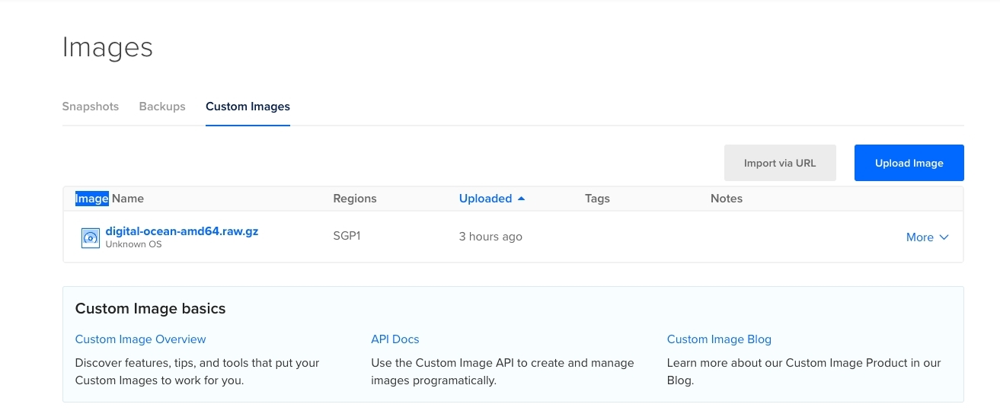
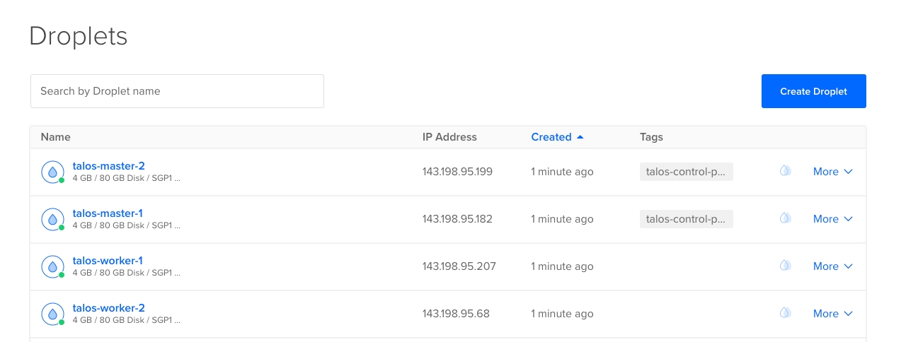
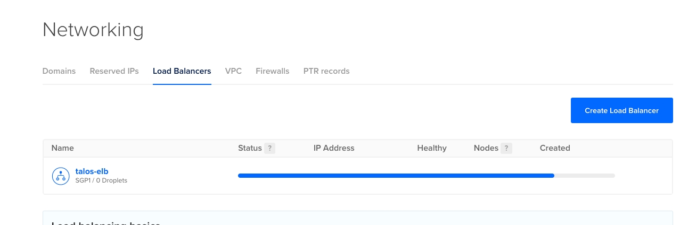
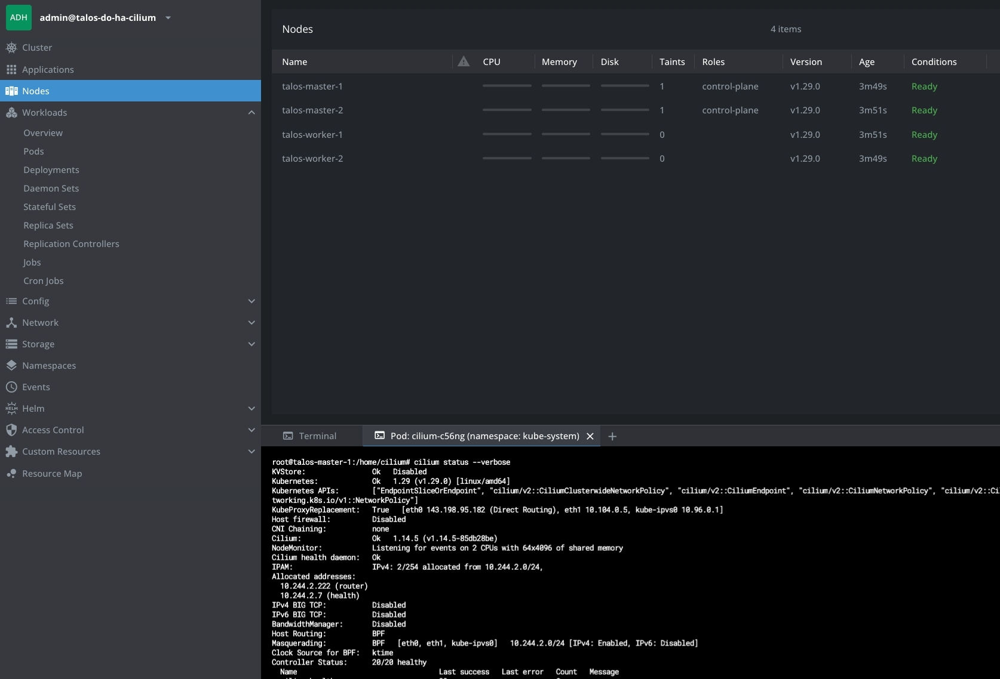

### Digitalocean Talos
### variables
#### terraform.tfvars
```
do_token            = "change me"
ssh_key             = "change me"
region              = "sgp1"
loadbalancer_name   = "talos-elb"
tag_elb_master_name = "talos-control-plane"
MASTER_COUNT        = 2
master_size         = "s-2vcpu-4gb"
master_name         = "talos-master"
WORKER_COUNT        = 2
worker_size         = "s-2vcpu-4gb"
worker_name         = "talos-worker"


```
#### upload image
[DigitalOcean image](https://github.com/siderolabs/talos/releases)
```
```

### screenshot







